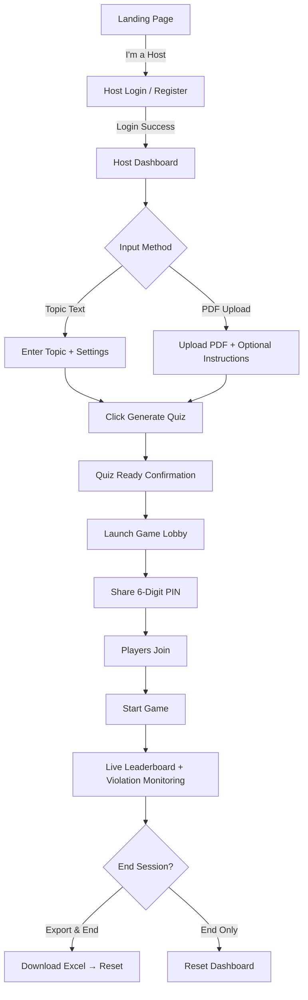
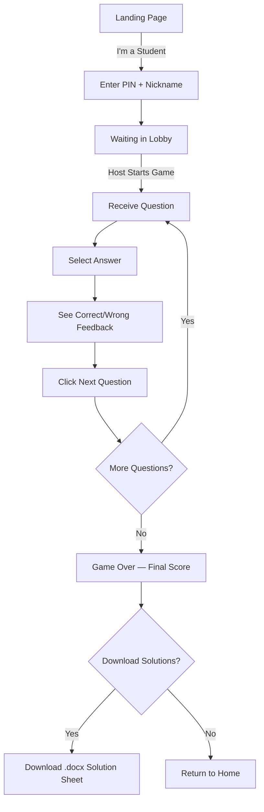
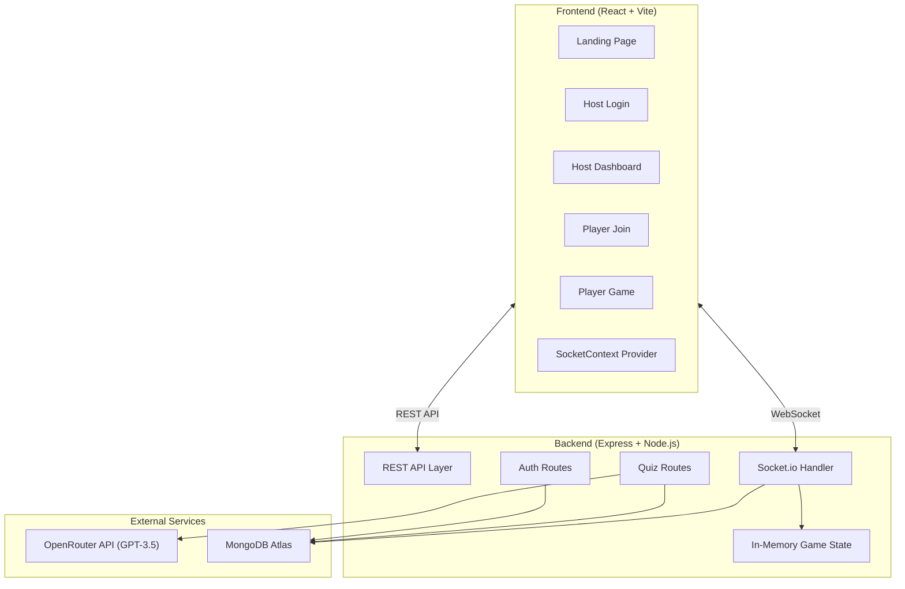

# Product Requirements Document (PRD)
## QuizMaster.AI — AI-Powered Real-Time Multiplayer Quiz Platform

| Field           | Value                                    |
|-----------------|------------------------------------------|
| **Product**     | QuizMaster.AI                            |
| **Version**     | 1.0.0                                    |
| **Author**      | Arya Verma                               |
| **Date**        | April 12, 2026                           |
| **Repository**  | `ai-quiz-builder` (monorepo)             |
| **Status**      | Development / MVP Shipped                |

---

## 1. Product Overview

QuizMaster.AI is a **real-time, multiplayer quiz platform** that leverages AI (OpenAI GPT-3.5 via OpenRouter) to instantly generate quizzes from any topic or uploaded PDF document. It follows a **Host → Player** interaction model where hosts create and monitor quiz sessions while players compete in real time — all connected through WebSockets.

### 1.1 Problem Statement

Traditional quiz creation is time-consuming and manual. Educators, trainers, and quiz organizers need a tool that:
- **Eliminates manual question authoring** by auto-generating quiz content from topics or study materials.
- **Enables real-time competitive sessions** similar to Kahoot! but with AI-powered content.
- **Provides academic integrity monitoring** for remote/online exam scenarios.
- **Offers exportable results** for grading and record-keeping.

### 1.2 Product Vision

> *"Transform any PDF or topic into an interactive battle of wits — powered by advanced AI for instant, unlimited learning."*

### 1.3 Key Value Propositions

| # | Value Proposition                              | Description                                                                     |
|---|------------------------------------------------|---------------------------------------------------------------------------------|
| 1 | **AI-Powered Quiz Generation**                 | Zero-effort quiz creation from any topic or PDF (lecture notes, textbooks, etc.) |
| 2 | **Real-Time Multiplayer**                      | WebSocket-driven live gameplay with instant score updates                        |
| 3 | **Anti-Cheating System**                       | Multi-layered browser monitoring (tab switch, blur, resize, screenshot block)    |
| 4 | **Data Export**                                | Excel export of scores, violations, and completion status for host records       |
| 5 | **Zero Friction for Players**                  | No account required — join with a 6-digit PIN and a nickname                     |

---

## 2. Target Users

### 2.1 User Personas

| Persona           | Description                                                              | Primary Goal                            |
|--------------------|--------------------------------------------------------------------------|----------------------------------------|
| **Host (Educator/Trainer)** | Teachers, professors, or corporate trainers who create and manage quizzes. Must register an account. | Generate quizzes quickly, monitor student activity in real time, export results. |
| **Player (Student/Participant)** | Students or participants who join live quiz sessions. No account needed. | Join via PIN, answer questions competitively, download solution sheets. |

### 2.2 Use Cases

1. **Classroom Assessment** — A professor uploads a PDF of lecture slides and runs a timed quiz during class.
2. **Corporate Training** — An HR trainer generates a quiz on compliance topics and tracks employee scores.
3. **Fun Trivia Night** — A group of friends creates a quiz on pop culture and competes remotely.
4. **Remote Exam** — An instructor monitors students taking a quiz with anti-cheating protections enabled.

---

## 3. User Flows

### 3.1 Host Flow



### 3.2 Player Flow



---

## 4. Feature Specifications

### 4.1 Authentication System (Host Only)

| Attribute        | Detail                                                                 |
|------------------|------------------------------------------------------------------------|
| **Registration** | Username + password. Password hashed with `bcryptjs` (10 salt rounds). |
| **Login**        | Returns JWT token (1-hour expiry). Stored in `localStorage`.           |
| **Auth Guard**   | Token sent via `Authorization: Bearer <token>` header on API calls.    |
| **Player Auth**  | None — anonymous join via PIN + nickname.                              |

**API Endpoints:**

| Method | Endpoint             | Body                           | Response                            |
|--------|----------------------|--------------------------------|-------------------------------------|
| POST   | `/api/auth/register` | `{ username, password }`       | `201 { message }`                   |
| POST   | `/api/auth/login`    | `{ username, password }`       | `200 { token, username }`           |

---

### 4.2 AI Quiz Generation

| Attribute           | Detail                                                                              |
|---------------------|--------------------------------------------------------------------------------------|
| **AI Provider**     | OpenAI API via [OpenRouter](https://openrouter.ai/api/v1)                            |
| **Model**           | `gpt-3.5-turbo`                                                                     |
| **Input: Topic**    | Free-text topic description (e.g., "The French Revolution, 10th grade difficulty")   |
| **Input: PDF**      | Uploaded via `multer`, parsed with `pdf-parse`, truncated to 15,000 chars as context |
| **Configurable**    | Number of questions (1–20), Time limit (1–60 minutes)                                |
| **Output Format**   | JSON: `{ title, questions: [{ text, options[4], correctIndex }] }`                   |
| **Test Mode**       | Topic `"test"` bypasses AI and returns mock questions for development/testing         |

**API Endpoint:**

| Method | Endpoint                | Content-Type        | Body (FormData)                                   | Response         |
|--------|-------------------------|---------------------|----------------------------------------------------|------------------|
| POST   | `/api/quizzes/generate` | `multipart/form-data` | `topic`, `numQuestions`, `timeLimit`, `pdf` (file) | `200 { Quiz }` |
| GET    | `/api/quizzes/:id`      | —                   | —                                                  | `200 { Quiz }` |

**Prompt Engineering Strategy:**

- For **PDF-based** quizzes: AI receives the extracted text as context plus optional topic/instructions.
- For **topic-based** quizzes: AI receives only the topic description.
- Response is constrained to `JSON only` — structured output with `title`, `questions[]`, `options[]`, and `correctIndex`.

---

### 4.3 Real-Time Game Engine (Socket.io)

The entire multiplayer game session is orchestrated via WebSocket events. Game state is held **in-memory** on the server (not persisted in the DB during gameplay).

#### Socket Event Map

| Event                     | Direction        | Payload                                          | Description                                       |
|---------------------------|------------------|--------------------------------------------------|---------------------------------------------------|
| `create_game`             | Player → Server  | `{ quizId }`                                     | Host creates a game room for a generated quiz     |
| `game_created`            | Server → Host    | `{ pin }`                                        | Returns the 6-digit PIN for the room              |
| `join_game`               | Player → Server  | `{ pin, name }`                                  | Player joins a lobby by PIN                       |
| `joined_game`             | Server → Player  | `{ pin }`                                        | Confirms player has joined                        |
| `player_joined`           | Server → Host    | `{ players[] }`                                  | Notifies host of updated player list              |
| `start_game`              | Host → Server    | `{ pin }`                                        | Host starts the game                              |
| `game_started`            | Server → All     | `{ totalTime }`                                  | Broadcasts game start + total time to all         |
| `new_question`            | Server → Player  | `{ text, options, current, total, timeLimit }`   | Sends the next question to a specific player      |
| `submit_answer`           | Player → Server  | `{ pin, answerIndex }`                           | Player submits their answer                       |
| `answer_result`           | Server → Player  | `{ isCorrect, correctIndex, score }`             | Returns whether the answer was correct            |
| `request_next_question`   | Player → Server  | `{ pin }`                                        | Player requests the next question (self-paced)    |
| `update_dashboard`        | Server → Host    | `{ players[], lastViolation? }`                  | Live leaderboard + violation update for host      |
| `player_violation`        | Player → Server  | `{ pin, type }`                                  | Reports a cheating violation event                |
| `game_over`               | Server → Player  | `{ score, quiz }`                                | Sent when player finishes all questions            |

#### Game State Model (In-Memory)

```javascript
games[pin] = {
    id: pin,               // 6-digit string
    hostId: socketId,       // Socket ID of the host
    quiz: Quiz,             // Full MongoDB Quiz document
    players: [{
        id: socketId,
        name: string,
        score: number,
        currentQuestionIndex: number,
        finished: boolean,
        violationCount: number,
        lastViolationType: string
    }],
    status: 'lobby' | 'active',
    startTime: timestamp
}
```

#### Gameplay Model: Self-Paced with Global Timer

- Each player progresses through questions **at their own pace** (self-paced model).
- A **global countdown timer** runs for all participants simultaneously.
- When the timer expires, all players are auto-finished regardless of progress.
- Scoring: **+1 mark per correct answer** (no negative marking, no time-based bonus).

---

### 4.4 Anti-Cheating System

The anti-cheating system monitors player browser activity during active gameplay and reports violations to the host in real time.

| Violation Type       | Trigger                                                        | Detection Method                    |
|----------------------|----------------------------------------------------------------|-------------------------------------|
| `minimize_or_tab`    | Player switches tabs or minimizes the browser window           | `visibilitychange` API              |
| `blur`               | Player clicks outside the quiz window (e.g., address bar)      | `window.blur` event                 |
| `resize`             | Player resizes the browser window                              | `window.resize` event               |
| Screenshot Block     | Player attempts `PrintScreen`, `Ctrl+P`, or `Cmd+Shift+S`     | `keyup` / `keydown` event listeners |

**Additional Protections:**
- Right-click context menu is disabled (`onContextMenu`)
- Copy/Cut/Paste operations are blocked (`onCopy`, `onCut`, `onPaste`)
- Text selection is disabled via CSS (`select-none`)
- When a violation occurs, a **full-screen blur overlay** covers the quiz content with an "Anti-Cheating Active" warning
- Each violation event is **debounced** (1-second cooldown per type) to prevent spam
- The host dashboard shows:
  - Per-player violation count + warning indicator
  - Real-time **toast notifications** for each violation (auto-dismiss after 5s, max 5 visible)

---

### 4.5 Host Dashboard — Live Monitoring

The host dashboard has **two modes**:

#### Creation Mode (No game active)
- Upload PDF or enter topic
- Configure number of questions (1–20) and time limit (1–60 min)
- Generate quiz via AI → Quiz-ready confirmation → Launch game lobby

#### Live Mode (Game in progress)
- **Sidebar panel**: Game status indicator, countdown timer, "Start Game" / "End Session" buttons, "Export to Excel"
- **Main area**: Live leaderboard sorted by score (descending), showing:
  - Rank position (gold/silver/bronze styling for top 3)
  - Player name
  - Current score
  - Violation count (highlighted in red if > 0)
  - Completion status (🏁 flag if finished)
- **Notification toasts**: Red violation alerts slide in from the right

---

### 4.6 Data Export

| Feature              | Format    | Library  | Content                                                     |
|----------------------|-----------|----------|--------------------------------------------------------------|
| **Host → Excel**     | `.xlsx`   | `xlsx`   | Rank, Player Name, Marks, Violations, Status (per player)    |
| **Player → Word**    | `.docx`   | `docx`   | Quiz title, score, all questions with options + correct answer |

- Host can export at any time during or after the game.
- The "End Session" modal offers "Export Results & End Session" as a combined action.
- Players can download solutions **only after the game ends**.

---

## 5. Technical Architecture

### 5.1 System Architecture



### 5.2 Technology Stack

| Layer           | Technology                                          | Version       |
|-----------------|-----------------------------------------------------|---------------|
| **Frontend**    | React                                               | 19.2.0        |
| **Build Tool**  | Vite                                                | 7.2.4         |
| **Styling**     | TailwindCSS                                         | 3.4.17        |
| **Routing**     | React Router DOM                                    | 7.10.1        |
| **State**       | React useState + Context API (SocketContext)         | —             |
| **Realtime**    | Socket.io Client                                    | 4.8.1         |
| **Backend**     | Node.js + Express                                   | 5.2.1         |
| **Database**    | MongoDB Atlas (via Mongoose)                        | 9.0.1         |
| **Realtime**    | Socket.io Server                                    | 4.8.1         |
| **AI**          | OpenAI SDK (via OpenRouter)                         | 6.10.0        |
| **Auth**        | JWT (`jsonwebtoken`) + bcryptjs                     | 9.0.3 / 3.0.3 |
| **File Upload** | Multer                                              | 2.0.2         |
| **PDF Parsing** | pdf-parse                                           | 1.1.1         |
| **Export (Host)**| xlsx                                                | 0.18.5        |
| **Export (Player)**| docx + file-saver                                | 9.5.1 / 2.0.5 |

### 5.3 Project Structure

```
ai-quiz-builder/                     # Monorepo root
├── package.json                     # Root scripts (install-all, build, start)
├── assets/                          # README screenshots
├── client/                          # React Frontend
│   ├── src/
│   │   ├── main.jsx                 # Entry point (BrowserRouter + SocketProvider)
│   │   ├── App.jsx                  # Route definitions
│   │   ├── index.css                # Global styles + Tailwind layers
│   │   ├── context/
│   │   │   └── SocketContext.jsx     # Socket.io provider
│   │   └── pages/
│   │       ├── LandingPage.jsx      # Role selection (Student / Host)
│   │       ├── HostLogin.jsx        # Login / Registration form
│   │       ├── HostDashboard.jsx    # Quiz creation + live monitoring (~490 LOC)
│   │       ├── PlayerJoin.jsx       # PIN + nickname entry
│   │       └── PlayerGame.jsx       # Quiz gameplay + anti-cheat (~320 LOC)
│   ├── tailwind.config.js           # Custom colors, animations
│   └── vite.config.js               # Vite configuration
└── server/                          # Express Backend
    ├── index.js                     # Server entry (Express + Socket.io + Mongoose)
    ├── .env                         # Environment variables
    ├── models/
    │   ├── User.js                  # User schema (username, password)
    │   └── Quiz.js                  # Quiz schema (title, questions[], totalTime)
    ├── routes/
    │   ├── auth.js                  # POST /register, POST /login
    │   └── quizzes.js               # POST /generate, GET /:id
    ├── socket/
    │   └── index.js                 # All socket event handlers (~158 LOC)
    └── uploads/                     # Temporary PDF storage (auto-cleaned)
```

---

## 6. Data Models

### 6.1 User Model

```javascript
{
    username:  { type: String, required: true, unique: true },
    password:  { type: String, required: true }  // bcrypt hashed
}
```
- Pre-save hook automatically hashes the password.
- Instance method `comparePassword()` for login verification.

### 6.2 Quiz Model

```javascript
{
    title:      String,
    topic:      String,
    questions:  [{
        text:         String,
        options:      [String],       // Always 4 options
        correctIndex: Number,         // 0-3
        timeLimit:    { type: Number, default: 20 }
    }],
    totalTime:  { type: Number, default: 10 },  // minutes
    createdAt:  { type: Date, default: Date.now }
}
```

---

## 7. Non-Functional Requirements

### 7.1 Performance

| Metric                         | Target                                           |
|--------------------------------|--------------------------------------------------|
| Quiz generation latency        | < 10 seconds (dependent on OpenRouter API)       |
| WebSocket event latency        | < 100ms (server-side processing)                 |
| Max concurrent players per game| Limited by server memory (in-memory state)        |
| PDF parsing                    | < 5 seconds for typical documents (< 100 pages)  |

### 7.2 Security

| Area                | Implementation                                         |
|---------------------|--------------------------------------------------------|
| Password storage    | bcrypt with 10 salt rounds                             |
| JWT                 | 1-hour expiry, signed with server-side secret          |
| CORS                | Currently `origin: '*'` (open — needs restriction for production) |
| File cleanup        | Uploaded PDFs are deleted immediately after parsing    |
| PDF size limit      | Context truncated to 15,000 characters                 |

### 7.3 Deployment

| Aspect               | Detail                                                          |
|-----------------------|------------------------------------------------------------------|
| **Architecture**      | Monorepo with separate client/server packages                    |
| **Production build**  | Vite builds React → `client/dist/`, Express serves static files  |
| **Environment Vars**  | `PORT`, `MONGODB_URI`, `JWT_SECRET`, `OPENAI_API_KEY`            |
| **Dev Server**        | Client: `vite dev` (port 5173) / Server: `nodemon` (port 5000)  |
| **Socket URL config** | Client uses `VITE_API_URL` env var, falls back to localhost      |

---

## 8. Design System

### 8.1 Color Palette

| Token         | Value       | Usage                    |
|---------------|-------------|--------------------------|
| `background`  | `#0f172a`   | Page background (Slate 900) |
| `surface`     | `#1f2937`   | Card backgrounds (Gray 800) |
| `primary`     | `#6366f1`   | Primary actions, accents (Indigo 500) |
| `secondary`   | `#8b5cf6`   | Gradients, secondary highlights (Violet 500) |
| `accent`      | `#10b981`   | Success states, CTAs (Emerald 500) |
| `danger`      | `#ef4444`   | Errors, violations (Red 500) |

### 8.2 Component Library (CSS Utilities)

| Class          | Description                                                          |
|----------------|----------------------------------------------------------------------|
| `btn-primary`  | Gradient button (primary → secondary) with hover scale + shadow      |
| `card-glass`   | Glassmorphism card with backdrop-blur, border, and 2xl shadow        |
| `input-glass`  | Dark input field with border glow on focus                           |

### 8.3 Animations

| Animation          | Duration | Usage                          |
|--------------------|----------|--------------------------------|
| `fade-in`          | 0.5s     | Page entry transitions         |
| `bounce-slow`      | 3s       | Lobby waiting indicator        |
| `pulse-fast`       | 1.5s     | Active PIN display             |
| `slide-in`         | 0.3s     | Violation toast notifications  |
| `gradient-x`       | —        | Animated gradient text on hero |

---

## 9. Known Limitations & Technical Debt

> [!WARNING]
> **Items requiring attention before production deployment:**

| #  | Item                                           | Severity | Notes                                                                |
|----|------------------------------------------------|----------|----------------------------------------------------------------------|
| 1  | **CORS is fully open** (`origin: '*'`)         | High     | Must be restricted to specific allowed origins in production.        |
| 2  | **Game state is in-memory only**               | High     | Server restart loses all active games. No persistence or recovery.   |
| 3  | **No auth middleware on quiz routes**           | Medium   | `/api/quizzes/generate` doesn't verify JWT — anyone can call it.     |
| 4  | **No rate limiting**                           | Medium   | AI generation endpoint vulnerable to abuse/cost spikes.              |
| 5  | **Socket disconnect handler is empty**         | Medium   | Player disconnects don't clean up game state properly.               |
| 6  | **JWT secret is hardcoded as fallback**        | Medium   | `'secret_key_change_me'` in auth.js if env var is missing.           |
| 7  | **No input validation/sanitization**           | Medium   | Topic text and username fields lack server-side validation.          |
| 8  | **PDF context truncation is naive**            | Low      | Hard cut at 15K chars — could split mid-sentence.                    |
| 9  | **OpenAI JSON parsing has no retry/fallback**  | Medium   | If AI returns non-JSON, the entire request fails with 500.           |
| 10 | **No loading states for socket events**        | Low      | Player UI doesn't show loading between socket emit and response.     |

---

## 10. Future Roadmap

> [!TIP]
> **Potential enhancements for v2.0 and beyond:**

| Priority | Feature                              | Description                                                                        |
|----------|--------------------------------------|------------------------------------------------------------------------------------|
| P0       | **Auth Middleware**                   | Secure quiz generation and game creation behind JWT verification.                  |
| P0       | **Persistent Game State**            | Store active games in Redis/MongoDB for crash recovery.                            |
| P1       | **Question Bank**                    | Allow hosts to save, edit, and reuse quizzes from a personal question bank.        |
| P1       | **Analytics Dashboard**              | Historical performance tracking — per-quiz, per-student, over-time trends.         |
| P1       | **Team Mode**                        | Support team-based quiz competition in addition to individual play.                |
| P2       | **Rich Question Types**              | Support image-based questions, true/false, fill-in-the-blank, and matching.        |
| P2       | **Audio/Video Questions**            | Embed multimedia in quiz questions via AI or host upload.                           |
| P2       | **OAuth Social Login**               | Allow Google/GitHub login for hosts instead of custom auth only.                   |
| P2       | **Mobile App**                       | React Native wrapper for a dedicated mobile player experience.                     |
| P3       | **AI Difficulty Calibration**        | Auto-adjust question difficulty based on player performance (adaptive quizzing).   |
| P3       | **Live Chat / Reactions**            | Allow players to react or chat during the lobby/results phase.                     |
| P3       | **Multi-Language Support**           | i18n support for both UI and AI-generated questions.                               |

---

## 11. Appendix

### 11.1 Environment Variables

| Variable         | Required | Description                                         |
|------------------|----------|-----------------------------------------------------|
| `PORT`           | No       | Server port (default: 5000)                         |
| `MONGODB_URI`    | Yes      | MongoDB Atlas connection string                     |
| `JWT_SECRET`     | Yes      | Secret key for JWT signing                          |
| `OPENAI_API_KEY` | Yes      | OpenRouter-compatible API key for AI quiz generation |
| `VITE_API_URL`   | No       | Client-side env var to override backend API URL     |

### 11.2 Codebase Metrics

| Metric                 | Value          |
|------------------------|----------------|
| Total source files     | ~15 files      |
| Largest file           | `HostDashboard.jsx` (489 lines, 29KB) |
| Server LOC             | ~400 lines     |
| Client LOC             | ~1,000 lines   |
| External API calls     | 1 (OpenRouter) |
| DB collections         | 2 (Users, Quizzes) |
| Socket events          | 12 unique      |
| Client routes          | 5 pages        |
| REST endpoints         | 4 (2 auth + 2 quiz) |
