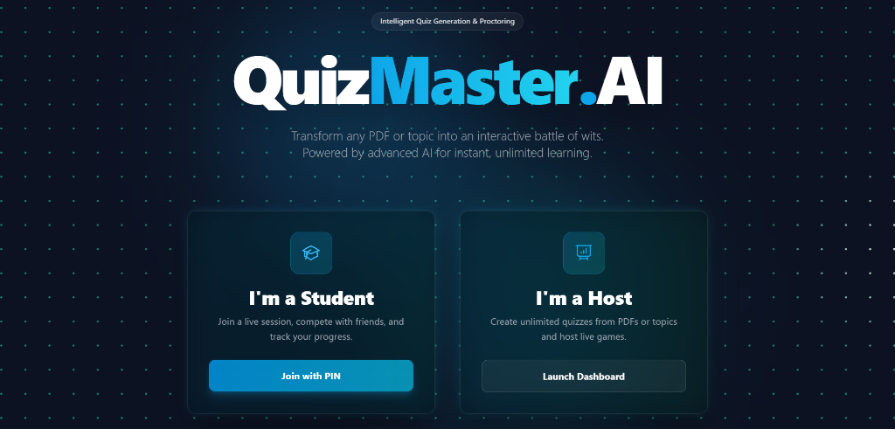
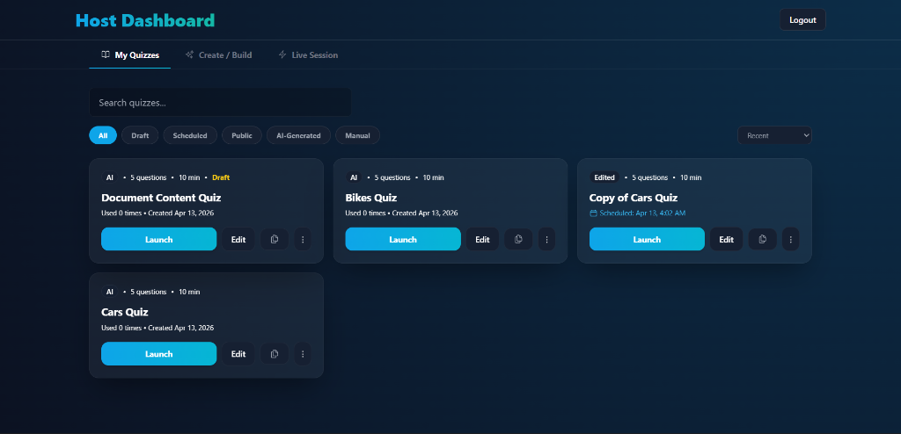
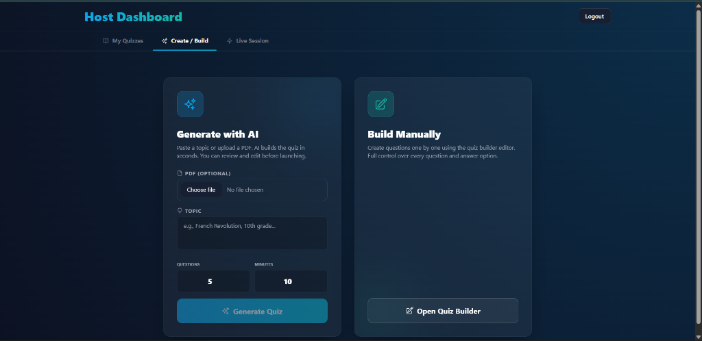
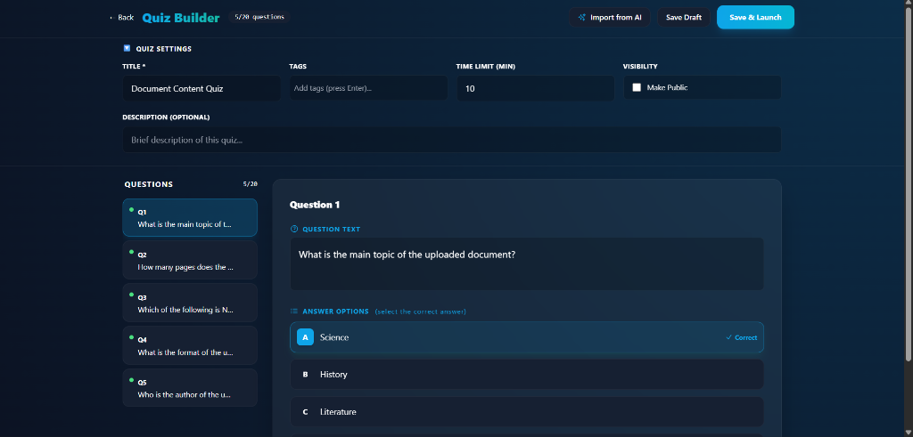
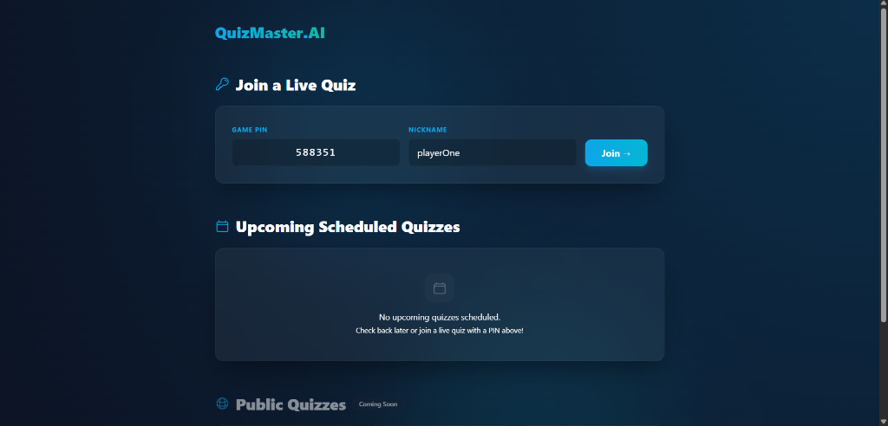
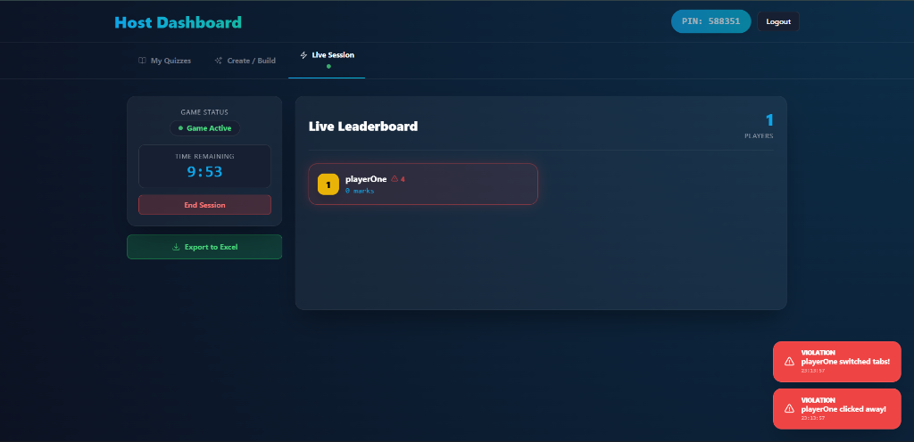
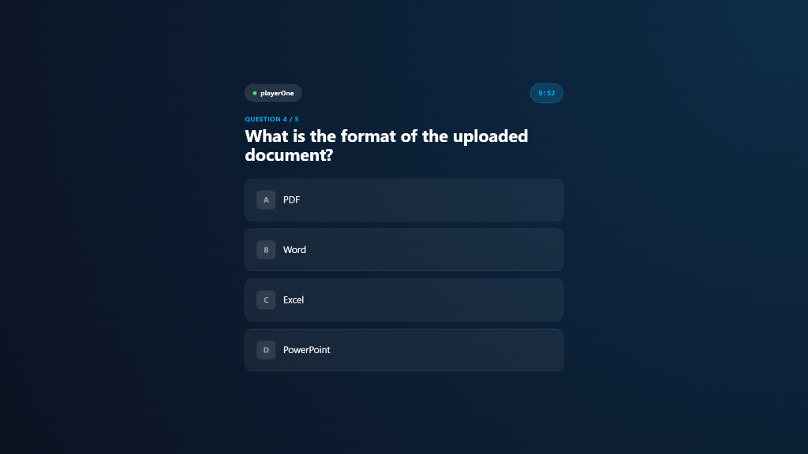

# QuizMaster.AI

**Transform any PDF or topic into an interactive battle of wits. Powered by advanced AI for instant, unlimited learning.**



## Overview
QuizMaster.AI is a real-time, multiplayer quiz platform that leverages OpenAI to automatically generate quizzes from any topic or uploaded PDF document. It features a seamless Host-Player interaction model with robust anti-cheating mechanisms, making it perfect for classrooms, corporate training, or fun trivia nights.

## Core Functions

### 1. Advanced AI-Powered Quiz Generation
- **Intelligent Content Extraction**: Upload study materials or enter a topic, and the AI rigorously extracts core educational concepts, tech details, and facts while strictly **avoiding** lazy summary or meta-document questions.
- **Customizable**: Set the number of questions and time limits per quiz.

### 2. Advanced Host Dashboard & Quiz Management
- **Custom Quiz Builder**: Manually construct rigorous quizzes using an intuitive custom builder, complete with tailored questions and distinct answer options.
- **Quiz Draft & Storage Feature**: Automatically save works-in-progress as drafts, and persistently store all your past successfully generated/built quizzes for easy retrieval and replay at any time!
- **Live Leaderboard**: Watch player scores update in real-time as they answer questions during a live session.
- **Detailed Excel Exports**: The final generated `.xlsx` report contains thorough breakdowns of player scores and explicit violation tracking (e.g., Screenshot Attempts, Fullscreen Exits).

### 3. Interactive Player Experience
- **Fluid & Modern UI**: Smooth animations, instant feedback on answers, and a highly competitive atmosphere to keep users engaged.
- **Easy Join**: Players join using a unique Game PIN—no account required.
- **Result Analysis**: Players can download a detailed Word document solution sheet after the game.

### 4. Impenetrable Anti-Cheating System
To ensure fair play and exam integrity, the application strictly monitors player activity:
- **Fullscreen Enforcement (Exam Mode)**: Before answering any questions, players must explicitly grant permission to enter **Fullscreen Mode**. Exiting fullscreen instantly pauses their game and logs an immediate violation. If they refuse to return, it persistently tracks "Not Fullscreen" violations natively on the Host's dashboard!
- **Screenshot & Snipping Tool Detection**: Detects OS-level combinations like `PrintScreen`, `Win+Shift+S`, and `Ctrl+P`. The screen immediately blurs, a violation is sent to the Host, and the clipboard is overwritten.
- **Focus Tracking**: Detects if the player switches tabs or minimizes the window.
- **Blur Detection**: Detects if the player clicks away from the quiz area.

---

## Walkthrough

### Step 1: Landing Page
Choose your role on our newly designed, interactive platform. Hosts can access the dashboard to create quizzes, while students can jump straight into an existing session with a Game PIN.


### Step 2: Host Dashboard - My Quizzes
The central hub for Hosts. Neatly view your works-in-progress (Drafts), AI-Generated quizzes, manually created quizzes, and easily launch them anytime.


### Step 3: Create & Build Hub
When creating a new quiz, effortlessly choose between instantly generating a sophisticated quiz via AI (from a PDF or Topic) or explicitly constructing one from scratch.


### Step 4: Custom Quiz Builder
If you prefer explicit control, our manual Quiz Builder allows you to meticulously craft individual questions, define correct distinct answers, add tags, and save drafts!


### Step 5: Player Join Lobby
Students can seamlessly join live sessions or scheduled quizzes using a secure 6-digit Game PIN—no frustrating accounts or logins required!


### Step 6: Live Session Host Monitoring
Hosts gain an immediate, real-time leaderboard alongside critical security alerts. Any attempts to exit Fullscreen or switch tabs will immediately flash **Red Violation Notifications** natively on the Host's screen.


### Step 7: Player Gameplay & Security Enforcement
Once connected, players must answer questions under strict Time and Fullscreen constraints. Our completely distraction-free interface ensures ultimate focus.


---

## Tech Stack
- **Frontend**: React, TailwindCSS, Socket.io-client
- **Backend**: Node.js, Express, Socket.io, MongoDB
- **AI**: OpenAI API (GPT-3.5/4)

## Installation

1. **Clone the repository**
   ```bash
   git clone https://github.com/yourusername/ai-quiz-builder.git
   cd ai-quiz-builder
   ```

2. **Install Dependencies**
   ```bash
   npm run install-all
   ```

3. **Environment Setup**
   Create a `.env` file in the `server` directory:
   ```env
   PORT=5000
   MONGO_URI=your_mongodb_connection_string
   OPENAI_API_KEY=your_openai_api_key
   JWT_SECRET=your_jwt_secret
   ```

4. **Run the Application**
   ```bash
   npm start
   ```
   This will start both the client and server concurrently.
