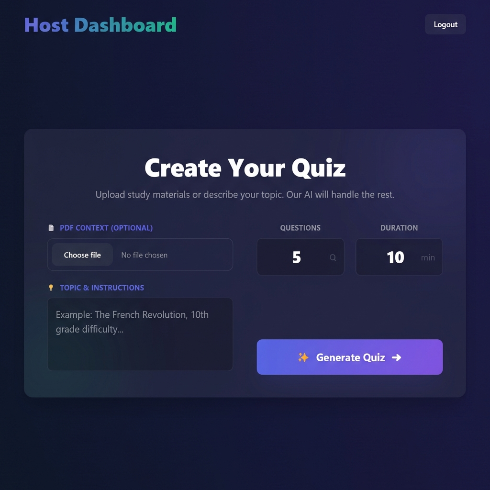

# QuizMaster.AI

**Transform any PDF or topic into an interactive battle of wits. Powered by advanced AI for instant, unlimited learning.**


## Overview
QuizMaster.AI is a real-time, multiplayer quiz platform that leverages OpenAI to automatically generate quizzes from any topic or uploaded PDF document. It features a seamless Host-Player interaction model with robust anti-cheating mechanisms, making it perfect for classrooms, corporate training, or fun trivia nights.

## Core Functions

### 1. AI-Powered Quiz Generation
- **Topic-based**: Simply type a topic (e.g., "The French Revolution", "Quantum Physics") and the AI generates relevant questions.
- **PDF-to-Quiz**: Upload study materials, lecture notes, or any PDF document. The system analyzes the content and creates a quiz tailored to that specific material.
- **Customizable**: Set the number of questions and time limits per quiz.

### 2. Real-Time Host Dashboard
- **Live Leaderboard**: Watch player scores update in real-time as they answer questions.
- **Cheat Monitoring**: Receive instant notifications if a player violates the anti-cheating rules (tab switching, minimizing, etc.).
- **Data Export**: Export the final results, including scores and violation reports, to Excel for grading or record-keeping.

### 3. Interactive Player Experience
- **Easy Join**: Players join using a unique Game PIN—no account required.
- **Engaging UI**: Smooth animations, instant feedback on answers, and a competitive atmosphere.
- **result Analysis**: Players can download a detailed solution sheet after the game.

### 4. Advanced Anti-Cheating System
To ensure fair play, the application monitors player activity:
- **Focus Tracking**: Detects if the player switches tabs or minimizes the window.
- **Blur Detection**: Detects if the player clicks away from the quiz area.
- **Resize Detection**: Monitors window resizing attempts.
- **Screenshot Prevention**: Blocks or flags screenshot attempts (browser dependent).

---

## Walkthrough

### Step 1: Landing Page
Choose your role. Hosts can access the dashboard to create quizzes, while students can join an existing session with a PIN.


### Step 2: Create a Quiz (Host)
Upload a PDF or enter a topic. Configure the number of questions and duration, then click "Generate Quiz".


### Step 3: Game Lobby & Monitoring
As a host, share the PIN with players. Once the game starts, you can monitor the live leaderboard.
> **Note:** The Red notifications indicate **Anti-Cheating Violations**. You can see exactly which player left the tab or lost focus.


### Step 4: Player Gameplay
Players answer questions in real-time. The interface is distraction-free to encourage focus.


---

## Tech Stack
- **Frontend**: React, TailwindCSS, Socket.io-client
- **Backend**: Node.js, Express, Socket.io, MongoDB
- **AI**: OpenAI API (GPT-3.5/4)

## Installation

1. **Clone the repository**
   ```bash
   git clone https://github.com/yourusername/ai-quiz-builder.git
   cd ai-quiz-builder
   ```

2. **Install Dependencies**
   ```bash
   npm run install-all
   ```

3. **Environment Setup**
   Create a `.env` file in the `server` directory:
   ```env
   PORT=5000
   MONGO_URI=your_mongodb_connection_string
   OPENAI_API_KEY=your_openai_api_key
   JWT_SECRET=your_jwt_secret
   ```

4. **Run the Application**
   ```bash
   npm start
   ```
   This will start both the client and server concurrently.
